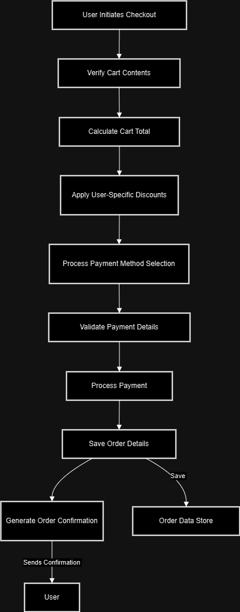

# **E-Wood: Your One-Stop Online Wood Trading Platform** 🌲💻

E-Wood is a cutting-edge e-commerce platform designed for trading wood across the country. With responsive design, theme support, and SEO optimization, E-Wood provides a seamless user experience for wood buyers.

---

## 📋 **Table of Contents**

- [**E-Wood: Your One-Stop Online Wood Trading Platform** 🌲💻](#e-wood-your-one-stop-online-wood-trading-platform-)
  - [📋 **Table of Contents**](#-table-of-contents)
  - [✨ **Introduction**](#-introduction)
  - [🚀 **Features**](#-features)
  - [💻 **Tech Stack**](#-tech-stack)
  - [⚙️ **Installation and Setup**](#️-installation-and-setup)
  - [🛠️ **Usage**](#️-usage)
  - [📐 **Data Flow Diagram (DFD)**](#-data-flow-diagram-dfd)
  - [🌐 **Live Demo**](#-live-demo)
  - [📜 **License**](#-license)
  - [💡 **Summary**](#-summary)

---

## ✨ **Introduction**

E-Wood simplifies the wood trading process with an intuitive platform tailored for businesses and individuals. It bridges the gap between suppliers and buyers by providing a robust, secure, and scalable solution.

---

## 🚀 **Features**

- **Responsive Design**: Optimized for devices of all screen sizes.
- **Theme Support**: Choose between dark and light modes.
- **SEO Optimized**: Enhanced discoverability on search engines.
- **Dynamic Product Carousel**: Showcase featured products interactively.
- **Intuitive UI**: Built with user experience in mind.
- **Live Product Details**: View comprehensive product details with one click.

---

## 💻 **Tech Stack**

E-Wood leverages modern frontend technologies for performance and scalability:

- **Frontend**:

  - [Next.js](https://nextjs.org/)
  - [React.js](https://reactjs.org/)
  - [TypeScript](https://www.typescriptlang.org/)
  - [ShadCN UI](https://shadcn.dev/)
  - [TailwindCSS](https://tailwindcss.com/)

- **Hosting**:
  - [Vercel](https://vercel.com/) for deployment.

---

## ⚙️ **Installation and Setup**

Follow these steps to set up E-Wood locally:

1. **Clone the Repository**:

   ```bash
   git clone https://github.com/yourusername/e-wood.git
   cd e-wood
   ```

2. **Install Dependencies**:

   ```bash
   npm install
   ```

3. **Start the Development Server**:

   ```bash
   npm run dev
   ```

4. **Access the Application**:
   Open [http://localhost:3000](http://localhost:3000) in your browser.

---

## 🛠️ **Usage**

- Browse through a variety of wood products.
- Filter by category and price to find the perfect match.
- View product details with high-quality images.
- Switch between light and dark themes for a personalized experience.

---

## 📐 **Data Flow Diagram (DFD)**

Below is a simple Data Flow Diagram for E-Wood's frontend:



---

## 🌐 **Live Demo**

Experience E-Wood in action: [https://e-wood.vercel.app/](https://e-wood.vercel.app/)

---

## 📜 **License**

This project is licensed under the [MIT License](LICENSE).

---

## 💡 **Summary**

E-Wood offers a seamless e-commerce platform for wood trading, leveraging advanced frontend technologies like Next.js, TypeScript, and TailwindCSS. Its responsive and theme-enabled design provides an intuitive shopping experience for all users.
